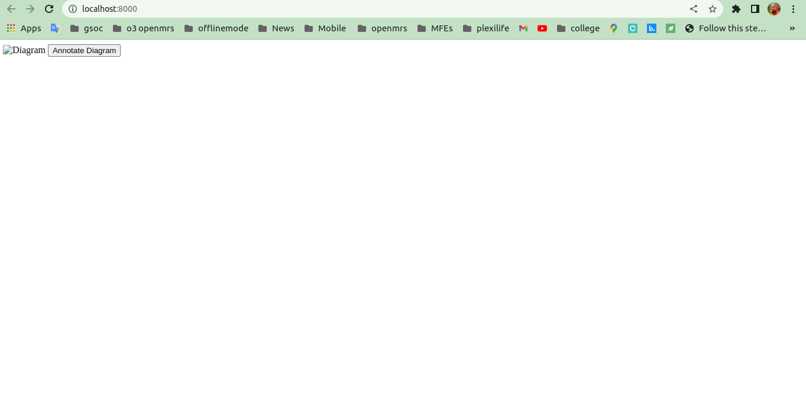

# afe-diagram-custom-control

Ampath forms diagraming custom component.

The end goal here is to have the ability to annotate diagrams in forms and to embed a diagram with some kind of annotation button.

## Get Started

Clone the repo. Then install.

```bash
npm install
```

Then start the dev server and rollup watchers

```bash
npm run dev
```

A browser window should open and rollup will watch your files for changes.

